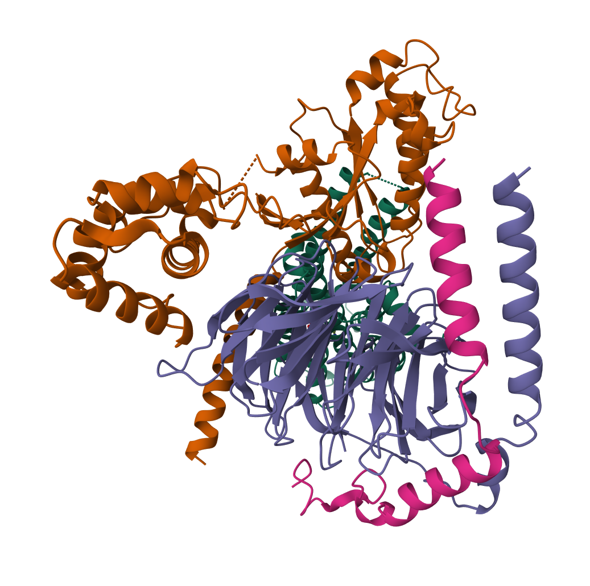
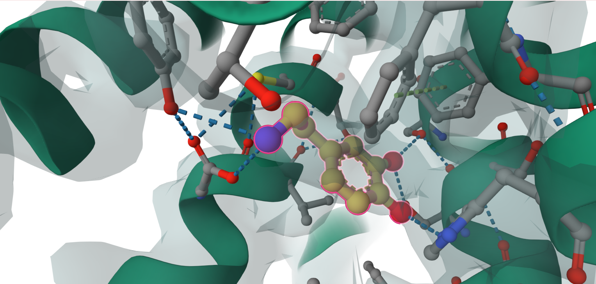
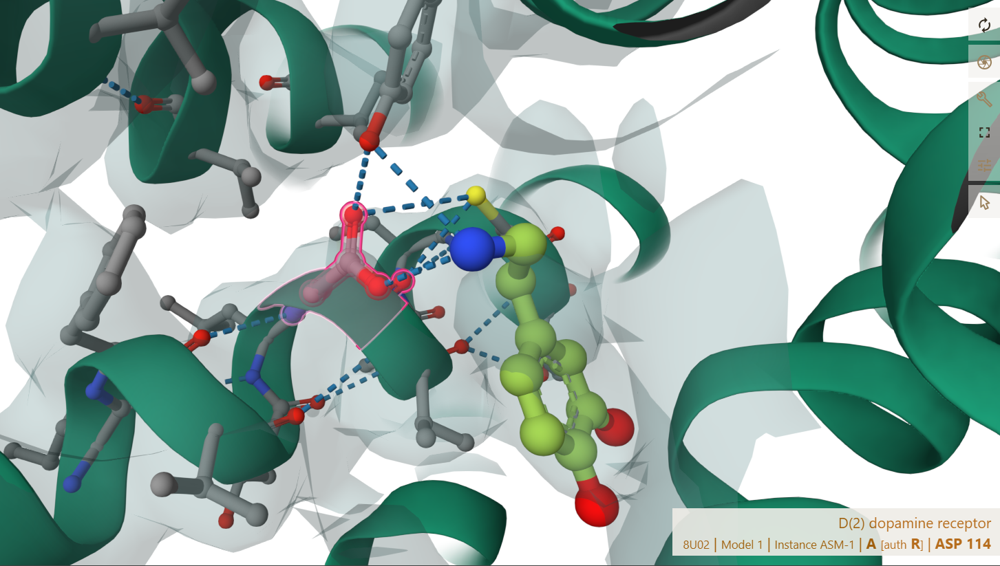

# drd2-protein-structural-modeling
Analyze an experimentally determined DRD2 structure and investigate how its 3d structure relate to ligand binding. 
## Structural Analysis of Dopamine Binding in Human DRD2

---

## Overview
Dopamine is a neurotransmitter that directs signaling in the central nervous system through dopamine receptors such as DRD2. 
DRD2 is a Class A G protein-coupled receptor (*GPCR*) involved in signaling in the central nervous system.
I analyzed how the DRD2 receptor binds to its ligand (Dopamine) through multiple non-covalent interactions. DRD2 structurally contains 7 transmembrane alpha - helices along with G-proteins as signaling partners. 

The project investigates the structure of human DRD2 using dopamine bound-structure **PDB 8U02**. It focuses on identifying the receptor residues that interact with dopamine, their respective transmembrane and determine how their chemical properties contribute to the ligand-binding pocket. 
I did structural analysis using PDBe/Mol* for visualisation and  GPCRdb for understanding dopamine-DRD2 multiple interactions. These interactions of the residues helped to understand how DRD2 binding-pocket stabilizes the dopamine and contributes to function of the receptor.

---

## Main research Question:
**How does the 3D structure of human DRD2 relate to its function and interaction with dopamine?**

 **Objectives investigated :** 
 
 01. Where does dopamine bind within the 3D structure of DRD2?
02. Which amino-acid residues form the dopamine-binding pocket?
03. Which transmembrane helices contain these residues?
04. What types of interactions do these residues make with dopamine?
05. How do these interactions help stabilize dopamine and relate to DRD2 activation?

---

## Structure and Ligand

* **Structure Selected: PDB 8U02**

For this project, I selected **PDB 8U02** which is a cryo-EM structure of human DRD2 bound to dopamine. 
It has total length of 443 amino acid (canonical form), further no mutation is present in the DRD2 receptor sequence. while, has model resolution of 3.28 Å. These features make it more suitable to be studied rather than short sequence with alternative splicing. 

* **Receptor : DRD2**

DRD2 (dopamine D2 receptor) is a **Class A G protein-coupled receptor (GPCR)** with seven transmembrane alpha-helices. The transmembrane regions consists of amino acid residues which interacts with dopamine while the intracellular regions interacts with G- proteins and are involved in receptor signaling.

* **Ligand : Dopamine/ L- Dopamine**

Dopamine as a ligand, binds to DRD2 and forms the binding pocket. It structurally consists of a positively charged amine group, two hydroxyl groups (OH) and an aromatic ring.

---

## Scientific background and Hypothesis

The DRD2 consists of seven alpha-transmembrane helices which consists of different amino acid residues. These residues interacts with the dopamine using multiple bonds which can be stronger such as Ionic or H-bond or electrostatic bonds and, also with weaker bonds including van der waals and aromatic or hydrophobic interaction. These interactions further forms the Dopamine-binding pocket. 
Dopamine binds via the residues to the receptor and changes its conformation i.e. the structural arrangement thus the intracellular side of DRD2 then interacts with G- proteins and allows receptor signaling.
The chemical properties of the amino acid side chains and their positions determine how dopamine is recognized and stabilized within the receptor. 

**Hypothesis**

The amino acid residues in DRD2 will create Dopamine-binding pocket that would helps dopamine to interact with receptor through multiple non-covalent interactions. These interactions may help stabilize dopamine and contribute to the conformational changes leading to receptor signaling.

--- 

### Methodology and Data source:

* **DRD2 Data:**  *Uniprot*
  
| Feature | Data |
|---|---|
| Protein name | Dopamine receptor D2 |
| Gene name | DRD2 |
| Organism | Homo sapiens |
| Amino-acid sequence | 443 |
| Isoform selected | P14416-1 |
| Subcellular location  | Postsynaptic cell-membrane, Cell-membrane and Golgi apparatus membrane |
| Dopamine interacting Transmembrane regions | TM3, TM5, TM6, TM7 |
| Function | *Uniprot* mentions it as 'Brain reward chemical' but it includes many functions such as Movement, learning and reward-signaling. | 

* **Structure 8U02:** *PDB* 

| Feature | Data |
|---|---|
| Structure | Cryo-EM (electron microscopy) | 
| Length | 443 aa |
| Ligand | Dopamine |
| Mutations | No mutation in receptor | 
| Resolution | 3.28 Å | 

* **PDBe** 

It used to visualize the 3D structure of DRD2 and examine individual receptor residues around the ligand.

* **GPCRdb**

It is used to identify dopamine–DRD2 interactions and determine transmembrane locations. It is also used to classify the interaction types. 

---

### Workflow Analysis 

   01. Used Uniprot to select the DRD2 sequence of human and chose its canonical isoform (long version).
   2.  Used **8U02 structure** on PDB as it was existing as an experimental 3D structure.
   3.  Analysed that experimental 3D structure using PDBe/mol*
   4.  First, Located the L-Dopamine within the transmembrane regions.
   5.  Secondly, checked the different amino acid residues surrounding the dopamine and their interaction with the dopamine molecule.
   6.  Then used  *GPCRdb* to verify the transmembrane helices and the interaction types i.e. bonds.
   7.  Compared the chemical properties of the different residues and how they interact with dopamine (dopamine-binding pocket)
   8.  These ligand-binding interactions were then related to the structure and function of DRD2.

---

### Results

*Figure 1. Overall structure of human DRD2 in complex with heterotrimeric Go protein in PDB 8U02.*

---

*Figure 2. Close-up view of dopamine within the DRD2 binding pocket. The highlighted dopamine molecule is surrounded by receptor residues from the transmembrane region, with dashed lines indicating contacts between the ligand and surrounding residues.*

---

 
*Figure 3. Close-up view of D114 (ASP 114) in TM3 showing its charge-assisted interaction with dopamine within the DRD2 binding pocket.*

---

* **Dopamine Binding pocket**
  
  From the PDB 8U02 Structure analysis, I observed that Dopamine is positioned within the TM regions. The ligand- binding region is formed by residues from **TM3, TM5, TM6 and TM7**. Therefore, binding-pocket involves multiple TM helices rather than a single region of receptor.
  These  multiple residues binds with the Dopamine and stabilizes the ligand.
  

  * **Residues interacting with Dopamine**
    
| Residue | Amino acid | GPCRdb position | TM region | Interaction types |
|---|---|---|---|---|  
| D114 | Aspartate | 3.32 | TM3 | Charge-assisted hydrogen bond |
| V115 | Valine |  3.33 | TM3  | Hydrophobic, van der Waals |
| C118 | Cysteine | 3.36 | TM3 | Van der Waals | 
| S193 | Serine | 5.42 | TM5 | Hydrogen bond |
| S197 | Serine | 5.46 | TM5 | Hydrogen bond |
| W386 | Tryptophan | 6.48 | TM6 | Hydrophobic, van der Waals |
| F389 | Phenylalanine | 6.51 | TM6 | Van der Waals, aromatic edge-to-face |
| F390 | Phenylalanine | 6.52 | TM6 | Hydrophobic,  van der Waals |
| H393 | Histidine | 6.55 | TM6 | Hydrogen bond , van der Waals |
| Y416 | Tyrosine | 7.43 | TM7 | Hydrogen bond |

* **Dopamine-Residue Mapping**
  
| Structure | Residues | Contributions | 
|---|---|---|
| Protonated Amine (positively charged) | D114 | charge-assisted hydrogen bond attracts dopamine in receptor-binding pocket | 
| Polar region | S193, S197, H393, Y416 | H-bonds helps in recognition of dopamine and stabilization |
| Aromatic ring (Hydrophobic) | W386, F389, F390, V115, C118 |Hydrophobic, van der Waals and aromatic interactions ensure molecules locks tightly and held together and therefore, provide stability. |

--- 

## Interpretation

The result shows that Dopamine binding in DRD2 is not dependent on single amino acid residue. The different residues from TM helices including TM3, TM5, TM6 and TM7 work together and form a **3D ligand-binding pocket**. 

The D114 residue in TM3 shows **charge-assisted interactions** with the positively charged amine group of dopamine and helps to attracting the dopamine molecule into the binding pocket. Whereas, other polar residues including S193, S197, H393 and Y416, contribute **hydrogen-bonding interactions** that help with recognition of dopamine and its positioning.

Residues including V115, C118, W386, F389 and F390 contribute hydrophobic, van der Waals and aromatic interactions. These interactions ensure that dopamine molecule locks tightly and is held together, contributing to the overall stability of the ligand within the pocket. The different chemical properties of the side chains allows the receptor to bind with dopamine and stabilize its ligand.
The intracellular surface of DRD2 is also associated with heterotrimeric Go- protein and it couples with the G-protein such as G-alpha-o, G-beta-1 and G-gamma-2. This interactions represents receptor signaling. To conclude, the 3D structure of DRD2 and the chemical properties of its residues allow it to interact with and stabilize dopamine. Therefore, contributing to its function as a dopamine receptor.

---

## Project access and Repositories

*GitHub Repository:*

[DRD2 Protein Structural Modeling](https://github.com/tanishkaprojects/drd2-protein-structural-modeling/blob/main/README.md)

 **UniProt:**
 
 [P14416 – Dopamine receptor D2](https://www.uniprot.org/uniprotkb/P14416/entry)
 
 **PDB:**
 
 [8U02 – Human DRD2 bound to dopamine](https://www.rcsb.org/structure/8U02)
 
 **GPCRdb:** 
 
 [PDB 8U02 Interaction Data](https://gpcrdb.org/interaction/8U02)
 
  **PDBe:**
  
  [PDB 8U02](https://www.ebi.ac.uk/pdbe/entry/pdb/8U02)

